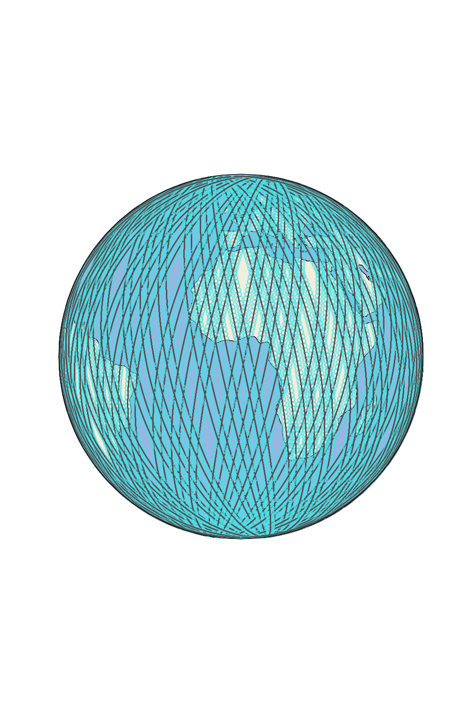
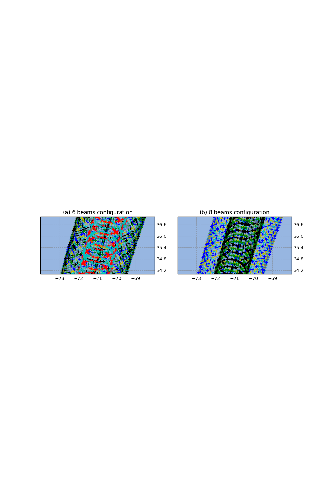
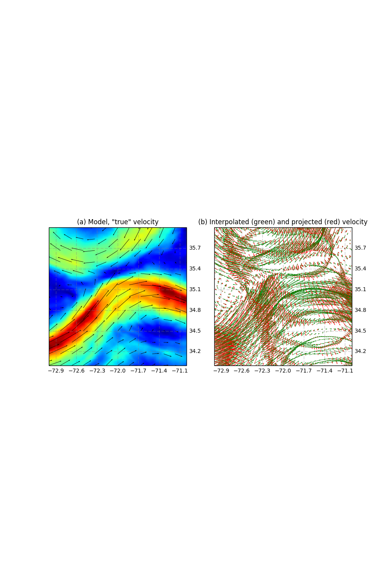
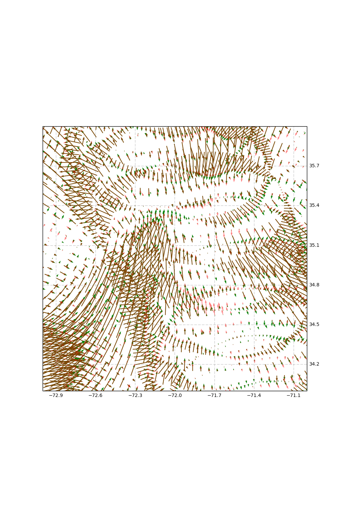
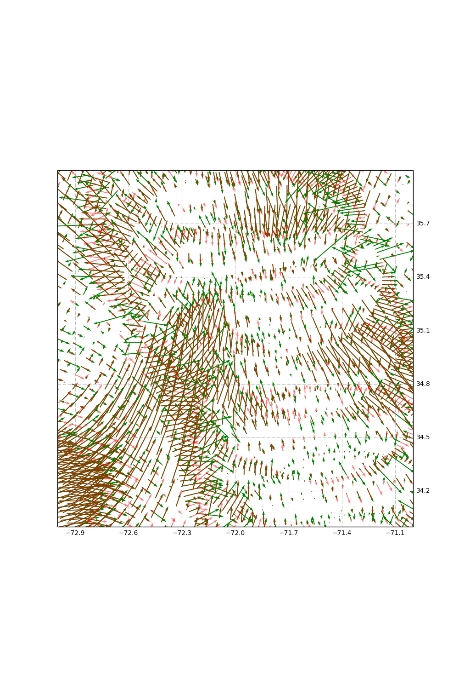

.. _science:
################################
SKIM Simulator
################################
Lucile Gaultier (OceanDataLab)

.. role:: red
.. toctree::
   :maxdepth: 2
   :numbered:

Abstract:
=========
This software simulates sea surface radial current (Level-2) synthetic
observations of the proposed SKIM mission that can be applied to an ocean
general circulation model (OGCM), allowing the exploration of ideas and
methods to optimize information retrieval from the SKIM Mission in the future.
From OGCM currents and Stoke drift inputs, the software generates SKIM-like
outputs on a rotating geometry around the orbit ground track, as well as
outputs from a nadir altimeter. Some measurement error and noise are generated
according to technical characteristics published by the SKIM project team. Not
designed to directly simulate the payload instrument performance, this SKIM
simulator aims at providing statistically realistic outputs for the science
community with a simple software package released as an open source in Python.
The software is scalable and designed to support future evolution of orbital
parameters, error budget estimates from the project team and suggestions from
the science community.


Simulation of the SKIM sampling over synthetic Sea Surface current
==================================================================
From a global or regional OGCM configuration, the software generates radial
velocities, including instrumental and geophysical noise, for each beam.
Note that for an accurate instrumental and geophysical noise, various forcings
are needed such as mean square slope, Stockes drift, wind, ice ...

.. _Fig1:



   FIG. 1: 5-day worth of SKIM simulated data in a global configuration with the science orbit.

.. _ProposedSKIMorbits:

Proposed SKIM orbits
---------------------
The software uses as an input the ground-tracks of the satellite orbit.

+-------------+--------------+--------------+------------+-------------+-----------+
|             | Repeat Cycle | Repeat Cycle | Sub-cycles | Inclination | Elevation |
|             | (days)       | (Orbits)     | (days)     |             | (km)      |
+=============+==============+==============+============+=============+===========+
| sentinel 1  |       12     |     175      |   6        |    90.18    |  698      |
+-------------+--------------+--------------+------------+-------------+-----------+
| **metop**   |      **29**  |   **412**    |   **5**    |  **98.63**  | **817**   |
+-------------+--------------+--------------+------------+-------------+-----------+
| fast sampl  |        3     |      43      |   0        |    98.5     |  775      |
+-------------+--------------+--------------+------------+-------------+-----------+
| fast sampl  |        8     |     113      |   0        |    98.8     |  845      |
| scanning    |              |              |            |             |           |
+-------------+--------------+--------------+------------+-------------+-----------+

The ground-track coordinates corresponding to these orbits are given as input
ASCII files of 3 columns (longitude, latitude, time) for one complete cycle
sampled at every  ~5 km. The first ascending node has been arbitrarily set to
270 degree of longitude, but the user can shift the orbit by any value in
longitude. The default orbit is metop.

Other orbit files of the same format (time, longitude, latitude) can also be
used as an input. To avoid distortions in the grid, we recommend a minimum of
10km sampling between the ground-track points of the orbit.

Note that the first two commented lines of the files concerns the satellite
cycle (in days) and elevation (in km).


::

    cycle = 29
    elevation = 817000


If these lines does not exist, the skimulator will look for these values in the
parameter file or take default value (cycle = 29 days and elevation = 817000)

The SKIM geometry
-----------------

From the orbit nadir ground track the software generates a grid covering the
swath over one satellite cycle. The longitude and latitude coordinates as well as
the time are referenced for each grid point. A scheme of the SKIM geometry is
presented on :ref:`Fig. 2 <Fig2>`.
The SKIM grid is stored by pass (e.g. 412 ascending passes and 412 descending
passes for the Metop orbit). A pass is defined by an orbit starting at
the lowest latitude for ascending track and at the highest latitude for
descending track. The first pass starts at the first lowest latitude crossing
in the input file, meaning that ascending passes are odd numbers and descending
passes are even numbers.

.. _Fig2:



   FIG. 2: scheme of the SKIM geometry with 4 beams at 12 degrees and 1 beam at 6 degree for figure a and 5 beams at 12 degrees and 2 beams at 6 degree for figure b.

Interpolation of model variables on the SKIM grid and nadir track
--------------------------------------------------------------------------
A list of model variables should be given to the skimulator, as well as a list
grids if the coordinates differ from one variable to another.
The naming of the netcdf files should be
:math:`[pattern\_model]\_[pattern\_variable].nc`, where :math:`pattern\_variable`
is a string.
All input variables must be given at the same regular time step.

The absolute time of the first time step is zero
and corresponds to the beginning of pass 1. A first date can be provided in
order to have a consistent timestamps in the netcdf file.  All provided
variables are
interpolated on the SKIM grid and nadir track for each pass and successive
cycles if the input data exceeds 1 cycle. Current and Stokes drift are then
projected along the radial component as only measurement along the radial axis
can be made.

No interpolation is made in time (the model file with the closest time step is
chosen). This avoids contaminations of the rapid signals (e.g. internal waves)
if they are under-sampled in the model outputs. However, note that locally,
sharp transitions of the variable along the swath may occur if the satellite
happens to be over the domain at the time of transition between two time steps.
By default a linear 2D spatial interpolation is performed to compute the variable
data on the SKIM grid.


:ref:`Fig. 3a <Fig3>` shows an input current as an example.
:ref:`Fig 3b <Fig3>` is the interpolated and radial component of the current.

.. _Fig3:



   FIG. 3: Model interpolated currents and the corresponding radial currents.

Simulation of errors
====================

Instrumental errors
-------------------
The instrumental error corresponds to the geometric doppler.
This component is proportional to sigma0 with a SNR specified in the parameter
file.
The following variables are needed to compute long range and short range mss:
mssu, mssc, mssd, uwnd, vwnd, ucur, vcur.

Computation of long range MSS:

.. math::
    mssxl = mssu * \cos(mssd)^2 + mssc * \sin(mssd)^2 \\
    mssyl = mssu * \sin(mssd)^2 + mssc * \cos(mssd)^2 \\
    mssxyl = (mssu - mssc) * \frac{\sin(2 * mssd)}{2}


Computation of short range MSS:

.. math::
   nwr = \sqrt{(uwnd - ucur)^2 + (vwnd - vcur)^2} \\ 
   wrd = \pi / 2 - arctan2(vwnd - vcur,\ uwnd - ucur) \\
   mssshort = \log(nwr + 0.7) * 0.009 \\
   mssshort[mssshort < 0] = 0
    
Directionality for short wave mss (if 0.5: isotrophic)

.. math::
   facssdw = 0.6 \\
   mssds = facssdw * mssshort \\
   msscs = mssshort - mssds \\
   mssxs = msscs * \sin(wrd)^2 + mssds * \cos(wrd)^2 \\
   mssys = mssds * \sin(wrd)^2 + msscs * \cos(wrd)^2 \\
   mssxys = |mssds - msscs| * \sin(2* wrd) \\

Computation of total MSS:

.. math::
   mssx = mssxs + mssxl \\
   mssy = mssys + mssyl \\
   mssxy = mssxys + mssxyl \\

:math:`\sigma^0` on water is computed from the total MSS:

.. math::
    B = -0.5 * \tan(beam)^2 * \frac{(\cos(azimuth)^2 * mssy + \sin(azimuth)^2 *mssx -\sin(2*azimuth)*mssxy)}{mssx * mssy} \\

.. math::
    A = \frac{R^2}{(2 * \cos(beam)^4 * \sqrt{mssx * mssy}} \\
    \sigma^0_{water} =  A \exp(B)

with :math:`R^2=0.55` which is a typical value for the tropics in Ka band.
Note that R depends on the radar frequency, water temperature and salinity
(e.g. :math:`R^2=0.50` for 3ºC water).


In the presence of ice, we use the concentration of sea ice :math:`C_{ice}`
and assume that :math:`\sigma^0_{ice}` is constant (:math:`\sigma^0_{ice}=2.5`
for 6º beam and :math:`\sigma^0_{ice}=1` for 12º beam).

.. math::
   \sigma^0 = (1 - C_{ice}) * \sigma^0_{water} +  C_{ice} * `\sigma^0_{ice}

Finally, the distribution of the instrumental error is a function of the azimuth following curves provided by the instruments simulator and a stretching proportional to
:math:`\sigma^0` is applied. A random number is picked from this distribution. 


.. _Fig4:


   FIG. 4: Model interpolated currents and the corresponding instrumental error.


Wave Doppler
------------
The geophysical doppler includes also part of the currents due to the Stokes
drift. This component is later referred as the current wave Doppler :math:`Uwd`.
To compute the wave doppler, a parametrisation has been learned. It depends on the radial Stokes drift (:math:`ussr`), the norm and the radial wind (:math `nwnd`, :math`wndr` ), the mean square slope (:math:`mss`) and the wave height (:math:`hs`). These parameters are either  interpolated from the model (true value) or we simulate their estimation from a wave spectrum. Note that the along track spectrum is supposed to be very noisy and thus an azimuthal interpolation is performed to assess along track signal.

The radial Stokes drift is estimated by averaging all the projected Stokes on the azimuth in a radius of 70 km. As there is a 180 degree ambiguity, the wind direction is considered to determine the :math:`ussr` sign. 
The wave height is retrieved from the altimeter, thus the nearest point at nadir is considered. 
The mean square slopes is either computed using the nearest point at 6º / nadir or by averaging all available noisy components in a 70 km radius. Note that a random noise has been applied to the :math:`mss` signal.
 
 
The parametrisation has been learned.
 
The 'true' wave doppler is computed using the previous parameters interpolated from the model inputs.  
The 'estimated' wave doppler is computed using the 'estimated' parameters as explained in the previous paragraph.
The error on the wave doppler is the difference between the 'estimated' and the 'true' doppler.  

The estimation of the Stokes drift and the mean square slope is degraded near the coast where all the azimuth are not available, and in areas where there is an important gradient. 
This is also the case in marginal ice zone, where points where there is ice are detected an handled separately.

.. _Fig5:



   FIG. 5: Model interpolated currents and the corresponding wave remaining doppler.

Sigma0 gradient in footprint
----------------------------
This gradient is statistically computed by stretching pdf of gradient of sigma0 as a function of sigma0 derived from Saral-Altika altimeter (in band Ka).

The pdf of Sarah-Altika has been provided by CNES. 

The gradient of sigma0 is then converted into a horizontal velocity.

Rain flagging
-------------
For each region, an ensemble of scenes is provided to statistically simulate rain patterns consistent with the weather in the area. These scenes have been derived from GPM observation at 5 km resolution. 
As the rain patterns are not correlated from on day to another, for each pass, a scene is randomly picked and interpolated on the swath as a function of the latitude. 
A rain flagging is applied by masking all points higher than a given threshold.


Note that there is also the possibility to derive the rain from model files if they are provided in the list of variables to be interpolated. Then this variable will be used for rain flagging. 

Atmospheric gradient
--------------------
A change in water content in the atmosphere have an impact on sigma0. The corresponding sigma0 gradient is computed directly from the gradient of PIA from the scenes previously used for rain flagging (derived from GPM data). 
The sigma0 gradient is then converted into a horizontal velocity 

Attitude
--------
AOCS remaining error is simulated using a spectrum provided by the technical instrumental team, thermal elastic dilatation are parametrised using tables provided by instrumental simulation. Both of these error are converted into velocities. 
Their correction is performed offline and the remaining error can be read into a file and added to the error budget. 


Total error
-----------
All previous errors are added to compute the total error. 

.. _Fig6:



   FIG. 6: Model interpolated currents and the corresponding total noise (instrumental + geophysical).


Simulation of errors for the nadir altimeter
============================================
Two main components of the nadir altimetry error budget are simulated: the
altimeter noise and residual wet-tropospheric errors. For the altimeter noise,
the noise follow a spectrum of error consistent with global estimates from the
Jason-2 altimeter.
The wet-tropospheric residual errors (not implemented yet) are generated using
the simulated wet-tropospheric signal and radiometer beam convolution described
in SWOT Simulator documentation.

.. raw:: latex

    \newpage

The software
============
The software is written in Python, and uses Numpy, Scipy and netCDF4 python
libraries. Pyresample is also required for L2C computation and faster
L2B interpolation.
All the parameters that can be modified by the user are read in a
params file (e.g. params.py) specified by the user. These parameters are
written in :ref:`yellow <params>` later on and are linked to their location in
the params file example.

The software is divided in 6 modules:

* :mod:`run_simulator.py` is the main program that runs the simulator.

* :mod:`mod_run.py` contains interpolations and data construction functions.

* :mod:`build_swath.py` generates the SKIM geometry and save several coordinates and angular variables in a netcdf file.

* :mod:`build_error.py` generates all the errors on the swath.

* :mod:`rw_data.py` contains all the classes to read and write model and SKIM data (in netcdf).

* :mod:`mod_tools.py` contains miscellaneous functions (algebraic functions and generation of random coefficients).

* :mod:`regridding.py` contains reconstruction algorithms for L2c products.

* :mod:`regriddingi_l2d.py` contains reconstruction algorithms for L2d products.

* :mod:`mod_uwb_corr.py` contains function to estimate wave doppler and associated parameters 


Inputs
------
You can provide to the simulator a list of model outputs in netcdf. You need
to have at least the meridional and zonal currents to compute error-free radial
L2B velocities and SSH if you want to simulate nadir data. Wind and MSS
are necessary to compute instrumental noise (proportional to :math:`sigma^0`),
Stokes drift, MSS, wave height and Wind are needed to compute true and estimated wave doppler. Ice concentration should
also be provided for realistic estimation of sigma0 in polar areas.
Any other variables provided to the skimulator will be interpolated on the
SKIM points. If rain is provided in these files, it will be interpolated and used for rain flagging

A list of files (in .txt format) is provided using :ref:`file_input <params-file>`
in the parameter file.

The extension should not be provided in the list_of_files:

::

   model_0001_
   model_0002_
   model_0003_

The corresponding model file for a variable `var` should be  model_0001_var.nc
For example, if all the variables are in the same file
:math:`myfile\_[date].nc`, the list of file will be:

::

   myfile_date1
   myfile_date2
   myfile_date3

FIG 19: Example of a list of files, a list is provided in the example directory.

The grid files are provided as a list in the parameter file, using the key
:ref:`file_grid_model  <params-model>`. Make a list of all grid files that are necessary for
your variables, the link between the variable and the grid is given
in a number in the :ref:`list_input_var  <params-model>`.
If no file_grid_model is provided, The skimulator is going to use the first
file of your list and data in this file will be ignored.


It is possible to generate the SKIM sampling alone, without using any model as an
input. If the name of the list of files
(:ref:`file_input <params-file>`) is set to `None`, then only SKIM grid files
will be generated.


The module :mod:`rw_data.py` is used to read model data. For any standard
netcdf format, the data can be read using
:ref:`model <params-model>` = MODEL_NETCDF, which is the
:ref:`model<params-model>` default value. The user needs to specify the list of
latitude (:ref:`lat <params-model>`) and longitude
(:ref:`lon <params-model>`) variables names corresponding to the list of grid
files provided in :ref:`file_grid_model  <params-model>`.
All other variables that are to be read, are added to the dictionary
:ref:`list_input_var <params-model>`:

::

  list_input_var = {'key': [[variable\_name], [variable\_extension_file], [number\_corresponding\_to_grid_file]]}

The following table summarizes the key that are required to compute
instrumental noise and wave bias:

+-------+---------------------------+-----------------------------------+
| Key   | corresponding variable    | Necessary to compute ...          |
+=======+===========================+===================================+
| ucur  | Zonal total current       | Wave bias, radial current         |
+-------+---------------------------+-----------------------------------+
| vcur  | Meridional total current  | Wave bias, radial current         |
+-------+---------------------------+-----------------------------------+
| uuss  | Zonal Stokes drift        | Wave bias                         |
+-------+---------------------------+-----------------------------------+
| vuss  | Meridional Stokes drift   | Wave bias                         |
+-------+---------------------------+-----------------------------------+
| ice   | Ice concentration         | Instrumental noise if there is ice|
+-------+---------------------------+-----------------------------------+
| mssd  | Direction long wave mss   | Instrumental noise                |
+-------+---------------------------+-----------------------------------+
| mssx  | Zonal MSS                 | Instrumental noise                |
+-------+---------------------------+-----------------------------------+
| mssy  | Meridional MSS            | Instrumental noise                |
+-------+---------------------------+-----------------------------------+
| ssh   | Sea Surface Height        | Nadir SSH                         |
+-------+---------------------------+-----------------------------------+
| uwnd  | Zonal wind                | Wave bias, Instrumental noise     |
+-------+---------------------------+-----------------------------------+
| vwnd  | Meridional wind           | Wave bias, Instrumental noise     |
+-------+---------------------------+-----------------------------------+
| rain  | rain quantity in mm/h     | Rain flagging if no scene avail.  |         
+-------+---------------------------+-----------------------------------+


Netcdf data that follow WW3 format can automatically be read
using :ref:`model <params-model>` = WW3 and there is no need to specify the
longitude or latitude variables name.
Below is an example of :ref:`list_input_var  <params-model>` for WW3 model
(all variables are on the same grid):

::

  file_grid_model = ('grid.nc', )
  lon = ('longitude', )
  lat = ('latitude', )
  list_input_var = {'ucur': ['ucur', 'cur', 0],
                    'vcur': ['vcur', 'cur', 0],
                    'uuss': ['uuss', 'uss', 0],
                    'vuss': ['vuss', 'uss', 0],
                    'ice': ['ice', 'ice', 0],
                    'mssd': ['mssd', 'msd', 0],
                    'mssx': ['mssc', 'mss', 0],
                    'mssy':['mssu', 'mss', 0],
                    'ssh': ['wlv', 'wlv', 0],
                    'uwnd': ['uwnd', 'wnd', 0],
                    'vwnd': ['vwnd', 'wnd', 0],
                    'rain': ['rain', 'rain', 0],}

Below is an example of :ref:`list_input_var  <params-model>` for a model with
an Arakawa grid (type C):

::

  file_grid_model = ('grid_u.nc', 'grid_v.nc', 'grid_T.nc')
  lon = ('lon_u', 'lon_v', 'lon_t')
  lat = ('lat_u', 'lat_v', 'lat_t')
  list_input_var = {'ucur': ['u', 'cur', 0],
                    'vcur': ['v', 'cur', 1],
                    'uuss': ['uuss', 'uss', 0],
                    'vuss': ['vuss', 'uss', 1],
                    'ice': ['ice', 'ice', 2],
                    'ssh': ['wlv', 'wlv', 2],
                    'uwnd': ['u10', 'wnd', 0],
                    'vwnd': ['v10', 'wnd', 1]}

The coordinates are supposed to
be in degrees and current variables in m/s in the program.

To refer timestamp properly in netcdf files, fill in the
:ref:`first_time  <params-model>` key
following  :ref:`first_time`='yyyy-mm-ddTHH:MM:SSZ'  <params-model>`.  By default,
:ref:`first_time`='2011-11-15T00:00:00Z'  <params-model>`.

If there is a ice_mask varying in time, set :ref:`ice_mask  <params-model>`
to False to
recompute the mask at every cycle.

The number of time in each file should be constant for all the files
and specified in the
:ref:`dim_time  <params-model>` parameter. The time step between two inputs
(:ref:`timestep <params-model>`) and the number of steps that have to be
processed (nstep) can be modified in the params file. The value corresponding
to not a number can be specified in :ref:`model_nan <params-model>`.

Generation of the SKIM geometry
-------------------------------
The SKIM grid is generated in the :mod:`build_swath.py` module. The orbit file
(:ref:`filesat <params-file>`) is located in :ref:`dir_setup <params-file>` and
contains longitude, latitude and the corresponding time for each point of the
orbit (see section :ref:`ProposedSKIMorbits` for more details on the provided
orbit). The orbit is interpolated at the cycle duration time resolution. The
rotation speed of the antenna is specified in
:ref:`rotation_speed <params-skimswath>` in tr/min. The provided value has been
computed to keep an integer number of illumination in the macro-cycle. The
geometry of beams is provided with lists and give for each beam a position in
radian (:ref:`list_pos <params-skimswath>`), an angle on the sensor in degree
(:ref:`list_angle <params-skimswath>`), an order for the illumination
(:ref:`list_shift <params-skimswath>`) with the macro-cycle starting with the
nadir beam.
The generation of the SKIM grid can be made on the whole region of the model
(:ref:`modelbox <params-skimswath>` = `None`) or on a subdomain
(:ref:`modelbox <params-skimswath>` = [lon_min, lon_max, lat_min, lat_max]). To
compute the noise alone (:ref:`file_input = None <params-file>`), a
:ref:`modelbox <params-skimswath>` has to be provided. If there is no pass on
the required domain, the user can specify a shift in longitude
(:ref:`shift_lon <params-skimswath>`).

A netcdf file containing SKIM grid information is stored for each pass in the
output directory (:ref:`outdatadir <params-file>`) under the name
:ref:`filesgrid <params-skimswath>` _p[pass].nc. It contains nadir variables
(_nadir) and other beams variables (one beam per column in the same order as in
the parameter file) for the following variables: along track and across track
distance from the nadir (in km), longitudes (lon) and latitudes (lat), time,
inclination at nadir, the number of days in a cycle (cycle) and the distance
crossed by the satellite in a cycle (al_cycle). Once the SKIM grid has been
created, it is stored in :ref:`outdatadir <params-file>`. As long as the domain
(:ref:`modelbox <params-skimswath>` parameter) and the geometry do not change,
the grids do not have to be recomputed and :ref:`makesgrid <params-skimswath>`
can be set to False.
For a more convenient use, in the example the name of the output files are a
concatenation of a :ref:`config <params-skimswath>` name and
:ref:`satname <params-file>` orbit name.

Radial current and error fields
--------------------------------
At each pass, for each cycle, an output netcdf file containing the currents
interpolated from the model as well as the interpolated current projected on
the radial direction (if :ref:`file_input <params-file>` is not set to `None`)
and the different errors are created. The output file names are
:ref:`file_output <params-output>` _c[cycle]_p[pass].nc for the swath and
:ref:`file_output <params-output>` _c[cycle]_p[pass].nc for the nadir. The SSH
is interpolated on the SKIM grid. If the model grid is regular, option
:ref:`grid <params-file>` can bet set to `regular` and RectBivariateSpline
interpolation from scipy is used. In all cases, :ref:`grid <params-file>` option
can be set to `irregular` and pyresample is used for the interpolation if the
module is installed. If the grid is irregular and pyresample is not installed,
mgriddata from scipy interpolates data is used with either the 'linear'
(:ref:`interpolation <params-output>` ='linear') or 'nearest' neighbor
(:ref:`interpolation <params-output>` ='nearest') option. In case of large
domain, this last solution for the mgriddata, interpolation can be slow and
even trigger memory error. The use of the ‘nearest’ interpolation is necessary
to avoid memory error though the derivative of the current can be significantly
altered using this interpolation method.
The :ref:`list_output  <params-output>` key  concerns the list of variables that you want to be
store in the netcdf files. The most common key are summarized in the table
below, you can add any other key that you want to interpolate on the SKIM grid:

+------------+----------------------------------+-----------------------------+
|Key         | Long name                        | Required for ...            |
+============+==================================+=============================+
| ur_true    | Radial error free velocity       | ur_obs                      |
+------------+----------------------------------+-----------------------------+
| ur_obs     | Radial velocity with errors      |                             |
+------------+----------------------------------+-----------------------------+
| ucur       | Meridional true current          | ur_true, ur_obs, sigma0,    |
+------------+----------------------------------+-----------------------------+
| vcur       | Zonal true current               | ur_true, ur_obs, sigma0,    |
+------------+----------------------------------+-----------------------------+
| uuss       | Meridional Stokes drift          | ur_obs, uwd, ussr, ussr_est |
+------------+----------------------------------+-----------------------------+
| vuss       | Zonal Stokes drift               | ur_obs, uwd, ussr, ussr_est |
+------------+----------------------------------+-----------------------------+
| instr      | Instrumental error               | ur_obs,                     |
+------------+----------------------------------+-----------------------------+
|radial_angle| Azimuthal angle                  | all                         |
+------------+----------------------------------+-----------------------------+
| uwnd       | Meridional wind                  | uwd, uwd_est, ur_obs, instr |
+------------+----------------------------------+-----------------------------+
| vwnd       | Zonal wind                       | uwd, uwd_est, ur_obs, instr |
+------------+----------------------------------+-----------------------------+
| mssx       | Meridional MSS                   | instr, ur_obs               |
+------------+----------------------------------+-----------------------------+
| mssy       | Zonal MSS                        | instr, ur_obs               |
+------------+----------------------------------+-----------------------------+
| mssxy      | Mixed MSS                        | instr, ur_obs               |
+------------+----------------------------------+-----------------------------+
| uwd        | True wave doppler                | ur_obs                      |
+------------+----------------------------------+-----------------------------+
| uwd_est    | Estimated wave doppler           | ur_obs                      |
+------------+----------------------------------+-----------------------------+
| sigma0     | NRCS                             | instr, uwd, uwd_est         |
+------------+----------------------------------+-----------------------------+
| ssh_obs    | Sea Surface Height with errors   | ssh_obs, nadir              |
+------------+----------------------------------+-----------------------------+
| ssh_true   | Error free Sea Surface Height    | ssh_obs                     |
+------------+----------------------------------+-----------------------------+
| ussr       | True radial stokes drift.        | uwd                         |
+------------+----------------------------------+-----------------------------+
| ussr_est   | Reconstructed radial stokes drift| uwd_est                     |
+------------+----------------------------------+-----------------------------+                
| dsigma0    | Azimuthal sigma0 gradient.       | ur_obs                      |
+------------+----------------------------------+-----------------------------+
| dsigm-atm  | sigma0 gradient due to atmosphere| ur_obs                      |
+------------+----------------------------------+-----------------------------+
 
To compute each error, set the corresponding parameter to True
(:ref:`instr <params-error>`, :ref:`ice <params-error>`,
:ref:`uwb <params-error>`, :ref:`nadir <params-error>`,
 :ref:`rain <params-error>`, :ref:`attitude <params-error>`).
If :ref:`nadir <params-error>` is True, then :ref:`ncomp1d  <params-error>`
should be specified to compute random error realisations. 
If :ref:`rain <params-error>` is True, the :ref:`rain_file <params-error>` that contains the path to the set of scenes and the :ref:`rain_threshold <params-error>` to flag rain above this threshold should be specified.


All the computed errors are saved in the output netcdf file. The observed SSH
(SSH_obs) is also computed by adding all the computed errors to the SSH from
the model (SSH_model) when model data are provided.

Two errors are considered in the nadir. The first one is the instrument error,
which follows the 1d spectrum computed from the current altimeters. You have
to set (:ref:`nadir <params-error>`) to True to compute this error.


L2C 2d currents
---------------
L2b radial current can be projected on a along swath and across swath grid
using the :code:`skimul2c` command with the same parameter file as the one used for
the L2b current production. It uses the L2b produced previously as an input.
The along track and across track grid resolution is specified in
:ref:`posting <params-l2c>`. By default, the spatial resolution of the grid is
5 km.
The L2c reconstruction uses neighbors to project and interpolate the current.
The length resolution to select neighbors can be set in
:ref:`resol <params-l2c>`. Coefficient for the OI are decreasing exponentially
with the distance to the pixel.
As data around nadir are particularly noisy (all radial velocity are
parallels), one can mask them by specifying the distance in km from nadir
where data are to be masked :ref:`ac_threshold <params-l2c>`.
The list of variables to be interpolated on the l2c grid is set in
:ref:`list_input_var_l2c <params-l2c>`.

A :ref:`l2c_config` variable can be specified to label a l2c configuration, this variable will be appended in the file name (:code:`[config]_l2c[l2c_config]_c[ncycle]_p[npass].nc`)

The L2c outputs contains along track, across track, meridional and zonal
current reconstructed from the error-free and radial velocity with errors.
True along track, across track meridional and zonal velocity interpolated
from the model inputs are also stored for diagnosis purposes.
All variables specified in the :ref:`list_input_var_l2c <params-l2c>` will be stored in the l2c Netcdf file.

L2D 2d currents
---------------
L2b radial current can be projected on a longitudinal and latitudinal grid
using the :code:`skimul2d` command with the same parameter file as the one used for
the L2b current production. It uses the L2b produced with :code:`skimul2b` as an input.
The along track and across track grid resolution is specified in
:ref:`posting_l2d <params-l2d>`. By default, the spatial resolution of the grid
is 0.1º x 0.1º.
The L2d reconstruction uses spatio-temporal neighbors to project and
interpolate the current.
The length resolution to select neighbors can be set in
:ref:`resol_spatial_l2d <params-l2d>` in space and
:ref:`resol_temporal_l2d <params-l2d>` in time. These numbers are scaling factors to increase or decrease default values.
Coefficient for the OI are decreasing exponentially
with the distance and time to the pixel.
The time domain to compute L2d can be set in
:ref:`time_domain <params-l2d>` and the spatial domain in
:ref:`spatial_domain <params-l2d>`.
The list of variables to be interpolated on the l2d grid is set in
:ref:`list_input_var_l2d <params-l2d>`.

The L2d outputs contains meridional and zonal
current reconstructed from the error-free and radial velocity with errors.
True meridional and zonal velocity interpolated
from the model inputs are also stored for diagnosis purposes.
The truth is averaged over the dtime specified in
`resol_temporal_l2d = (start_time, end_time, dtime)`


Getting started 
----------------
All information regarding the installation and running of the software are in
the :ref:`README <README>` file. An example of a :ref:`params.txt <params>` file is given
below.

Once you have installed skimulator, you can print help by typing in a python
or ipython window:

.. code-block:: python

   >>>import skimulator.M
   >>>help(skimulator.M)

with M the name of the module.

To compute L2b products:

.. code-block:: python

   >>>skimul2b [your_parameter_file]


You can compute L2c products after L2b files have been produced, keep the same
parameter file and run:

.. code-block:: python

   >>>skimul2c [your_parameter_file]

You can compute L2d products after L2b files have been produced, keep the same
parameter file and run:

.. code-block:: python

   >>>skimul2d [your_parameter_file]

.. _params:

Example of Params.txt for SKIM-like data
``````````````````````````````````````````

.. _params-file:

.. code-block:: python

   # ------ Name of the configuration (to build output files names)
   config = [yourconfig]
   # ------ Directory that contains orbit file:
   dir_setup = os.path.join([yourpath], 'skimulator', 'data')
   # ------ Directory that contains your own inputs:
   indatadir = '[yourpath_to_yourdata]/'
   # ------ Directory that contains your outputs:
   outdatadir = '[yourpath_to_outputs]/'
   # ------ Orbit file:
   satname = [chosenorbit]
   filesat = os.path.join(dir_setup, [chosenorbit])
   # ------ Number of days in orbit (optional if specified in orbit file)
   satcycle = 29
   # ------ Satellite elevation (optional if specified in orbit file)
   sat_elev = 817 * 10**3
   # ------ Order of columns (lon, lat, time) in orbit file
   # (default is (0, 1, 2) with order_orbit_col = None)
   order_orbit_col = None
   # , dir_setup+os.sep+'orbjason.txt', dir_setup+os.sep+'orbaltika.txt' ]
   # ------ Number of processors for parallelisation purposes
   proc_number = [number of processor (integer)]
   # ------ Deactivate printing of progress bar to avoid huge log
   progress_bar = True or False

.. _params-skimswath:


.. code-block:: python

   # -----------------------#
   # SKIM swath parameters
   # -----------------------#
   # ------ Satellite grid file root name:
   #        (Final file name is root_name_[numberofpass].nc)
   filesgrid = os.path.join(outdatadir, '{}_grid'.format(config))
   or filesgrid = os.path.join(outdatadir, '[your_grid_root_name]')
   # ------ Force the computation of the satellite grid:
   makesgrid = True or False
   # ------ Give a subdomain if only part of the model is needed:
   #        (modelbox=[lon_min, lon_max, lat_min, lat_max])
   #        (If modelbox is None, the whole domain of the model is considered)
   modelbox =  None or [yourlon_min, yourlon_max, yourlat_min, yourlat_max]
   #------- Rotation speed of the antenna (in tr/min)
   rotation_speed = rotation depends on the chosen config
   #------- List of position of beams:
   list_pos = (0, [angle_in_rad], [angle_in_rad] ...)
   #------- List of angle of beams in degrees:
   list_angle = ([incidence], [incidence], [incidence] ...)
   #------- List of timeshift as regard to nadir for 12 degree beams:
   list_shift = (1, 3, 2 ...)
   #------- Cycle duration
   cycle = 0.0368
   # ------ Shift longitude of the orbit file if no pass is in the domain
   #        (in degree): Default value is None (no shift)
   shift_lon = 0
   # ------ Shift time of the satellite pass (in day):
   #        Default value is None (no shift)
   shift_time = None

.. _params-model:

.. code-block:: python

   # -----------------------#
   # Model input parameters
   # -----------------------#
   # ------ List of model files:
   #        (The first file contains the grid and is not considered as model data)
   #        To generate the noise alone, file_input=None and specify region
   #        in modelbox
   file_input = os.path.join(indatadir, [your_list_of_file_name.txt]' or None
   # ------ Type of model data:
   #        (Optional, default is NETCDF_MODEL and reads netcdf3 and netcdf4 files)
   #        (Other option is WW3)
   model = 'WW3' or 'NETCDF_MODEL'
   # ------ First time of the model
   first_time = 'yyyy-mm-ddTHH:MM:SSZ'
   # ------ Grid file name
   file_grid_model = (os.path.join(indatadir, [yourgridfileu]),
                      os.path.join(indatadir, [yourgridfilev]),)
   # ------ Specify if there is a ice mask for high latitudes
   #        (if true, mask is recomputed at each cycle)
   ice_mask = False or True
   # ------ Type of grid:
   #        'regular' or 'irregular', if 'regular' only 1d coordinates
   #        are extracted from model
   grid = 'regular'
   # ------ Specify list of variable:
   list_input_var = {'ucur': [[u_var], [vel_ext], 0], 'vcur': [[v_var], [v_ext], 1],
                     'uuss': [[uuss_var], [uss_ext], 0], 'vuss': [[vuss_var], [uss_ext], 1],
                     'ice': [[ice_var], [ice_ext], 0], 'mssd': [[mssd_var], [msd_ext], 0],
                     'mssx': [[mssx_var], [mss_ext], 0], 'mssy':[[mssy_var], [mss_ext]],
                     'ssh': [[ssh_var], [ssh_ext], 0],
                     'uwnd': [[uwnd_var], [wnd_ext], 0], 'vwnd': [[vwnd_var], [wnd_ext], 1]}
   # ------ Specify longitude variable:
   lon = ('longitude', 'longitude')
   # ------ Specify latitude variable:
   lat = ('latitude', 'latitude')
   # ------ Specify number of time in file:
   dim_time = 24
   # ------ Time step between two model outputs (in days):
   timestep = 1/24.
   # ------ Number of outputs to consider:
   #        (timestep*nstep=total number of days)
   nstep = 35*24
   # ------ Not a number value:
   model_nan = -32767.

.. _params-output:

.. code-block:: python

   # -----------------------#
   # SKIM output files
   # -----------------------#
   # ------ Output file root name:
   #        (Final file name is root_name_c[cycle].nc
   file_output = os.path.join(outdatadir, config)
   # ------ Interpolation of the SSH from the model (if grid is irregular and
   #         pyresample is not installed:
   #        (either 'linear' or 'nearest', use 'nearest' for large region
   #        as it is faster and use less memory.)
   interpolation = 'nearest' or 'linear'
   # ------ List of output variables:
   list_output = ['ssh_obs', 'ur_true', 'ucur', 'vcur', 'uuss', 'vuss', 'instr',
                  'radial_angle', 'vwnd', 'mssx', 'mssy', 'mssxy', 'uwb',
                  'ssh_true', 'ssh', 'ice', 'mssd',
                  'vindice', 'ur_obs', 'uwnd', 'sigma0']

.. _params-error:

.. code-block:: python

   # -----------------------#
   # SKIM error parameters
   # -----------------------#
   # ------ File containing random coefficients to compute and save
   #        random error coefficients so that runs are reproducible:
   #        If file_coeff is specified and does not exist, file is created
   #        If you don't want runs to be reproducible, file_coeff is set to None
   file_coeff = None  or os.path.join(outdatadir, 'Random_coeff.nc')
   # Compute instrumental nadir noise:
   nadir = True
   # ------ Number of random realisations for instrumental and geophysical error
   #        (recommended ncomp=2000), ncomp1d is used for 1D spectrum, and ncomp2d
   #        is used for 2D spectrum (wet troposphere computation):
   ncomp1d = 3000
   ncomp2d = 2000
   # ------- Instrument white noise error
   instr = True or False
   # ------- Choice of instrument configuration
   instr_configuration = 'A' or 'B'
   # ------- Attitude error
   attitude = True or False
   # ------- File which provide the AOCS error:
   yaw_file = os.path.join(dir_setup, 'sample_req1.nc')
   # -- Geophysical error
   ## ----------------------
   # ------ Consider ice in sigma0 computation
   ice = True or False
   # ------ Rain error (True to compute it):
   rain = True or False
   # ------ Rain file containing scenarii (python file):
   rain_file = os.path.join(dir_setup, [yourrainscenarii])
   # ------ Threshold to flag data:
   rain_threshold = 0.15
   # ------- Wave bias
   uwb = True or False

.. _params-l2c:

.. code-block:: python

   # -----------------------#
   # L2C computation
   # -----------------------#
   # config name for L2c:
   config_l2c = '[yourl2cconfig]'
   # Length resolution to select neighbors (in km):
   resol = 40
   # Grid resolution for l2c (alongtrack, acrosstrack) grid (in km):
   posting = 5
   # Remove noisy data around nadir (in km):
   ac_threshold = 20
   # List of variables to be interpolated on the swath:
   list_input_var_l2c = {'ucur': ['ucur', 'cur', 0], 'vcur': ['vcur', 'cur', 1]}

.. _params-l2d:

.. code-block:: python

   # -----------------------#
   # L2D computation
   # -----------------------#
   # config name for L2d:
   config_l2d = ''
   # Length resolution to select neighbors (multiplication factor):
   resol_spatial_l2d = 1
   # Temporal resolution to select neighbors (multiplication factor):
   resol_temporal_l2d = 1
   # Grid resolution for l2d (lat, lon) grid (in degrees):
   posting_l2d = (0.1, 0.1)
   # Time domain: (start_time, end_time, dtime) in days:
   time_domain = (5, 25, 1)
   # Spatial domain (lon_min, lon_max, lat_min, lat_max):
   spatial_domain = [0, 360, -90, 90]
   # List of variables to be interpolated on the grid:
   list_input_var_l2d = {'ucur': ['ucur', 'cur', 0], 'vcur': ['vcur', 'cur', 1]}


References:
===========
.. _SKIM_proposal_2017:

  The SKIM team Sea surface KInematics Multiscale monitoring, full proposal for
  ESA EE9, 2017, The SKIM team


